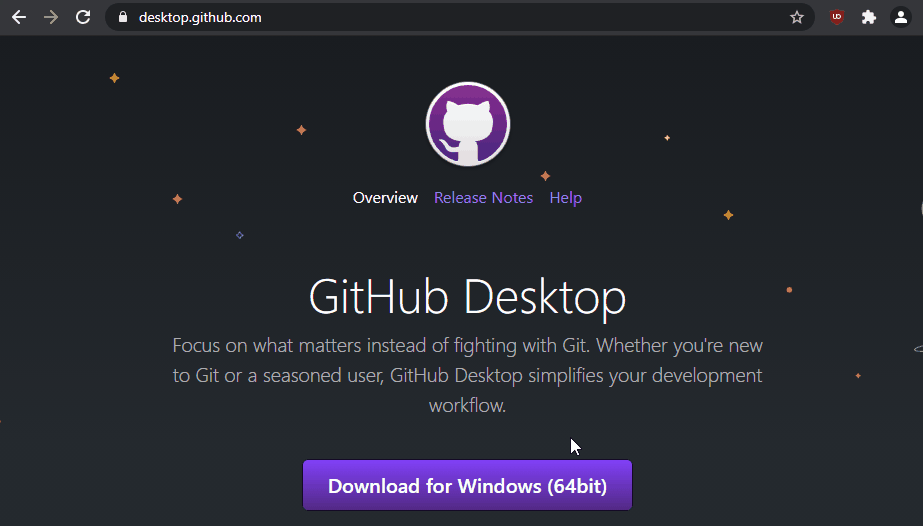

# Seting up Git

### Make a GitHub account

First things first, make sure to create a GitHub account if you do not have one already. Head over to https://github.com/join to create one!

### There are two ways to use git locally on your computer:

- Github CLI
- Github Desktop

## Github CLI

### Installation

#### Windows

You can download the executable from the following page for Microsoft Windows.

Link: https://git-scm.com/download

Once downloaded, follow the on screen prompts to install. As a beginner, it's pretty safe to not change anything and just install the default configuration. Once that is done, you will find a program called _'Git Bash'_ in your Start menu. Congratulations! You've successfully installed Git.

#### MacOS

Assuming you have Homebrew installed and setup, you can go ahead and run:

```sh
brew install git
```

#### Linux

There are quite a few distros out there, and you'll need to use their respective package managers.

- **Ubuntu and derivatives:** `sudo apt install git`

- **Fedora, RHEL based distributions:** ` sudo dnf install git`

- **SUSE based distributions:** `sudo zypper install git`

- **Arch 😎 based distributions:** `sudo pacman -S git`

### Configuring Git CLI

Whether you installed git on Windows, MacOS or Linux, this configuration step is the same!

To begin using GitHub from your local machine, you need to set a username and email address to identify yourself while making commits and what not. To do so, you have to run a couple of commands on your command prompt/terminal.

_Username :_ `git config --global user.name "FIRST_NAME LAST_NAME"`

_E-Mail ID:_ `git config --global user.email "MY_NAME@example.com"`

_NOTE: Make sure to use the same email address that you signed in to GitHub with!_

## Github Desktop

If you want to work with Git locally and you're worried about the command line experience, you can initially download and use the GitHub Desktop interface that provides most of the essential features of GitHub. Download it and follow the onscreen prompts.

Download Github Desktop: https://desktop.github.com
(Download the appropriate version of Github Desktop for your operating system.)

Below is a demo gif of installing and configuring GitHub desktop! (We use Windows 10 here, but the same steps apply if you're using a Mac)


